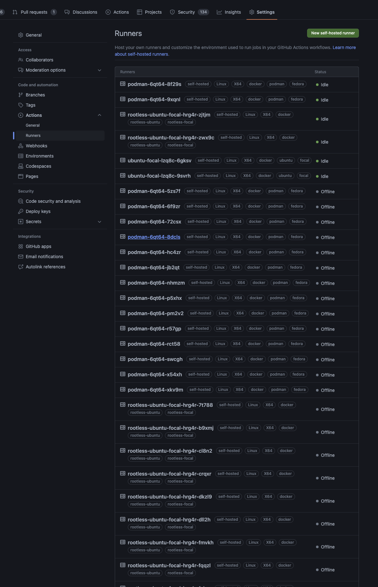

# Runner reaper for self-hosted GitHub Actions Runners

This is a quick GitHub Action that leverages the API to forcefully unregister all offline self-hosted runners.

> **Warning**
> As you'd expect, this Action force-removes all offline self-hosted runners in the scope provided!  It does _not_ actually do anything to the runners (VMs, bare metal boxes, etc).  This is useful if the runners are ephemeral containers and no longer exist.

## Inputs

| Name | Description | Options | Defaults |
| --- | --- | --- | --- |
| `GITHUB_PAT` | Personal access token (PAT) of the appropriate scope | n/a, store as a [secret](https://docs.github.com/en/actions/security-guides/encrypted-secrets) | n/a, store as a [secret](https://docs.github.com/en/actions/security-guides/encrypted-secrets) |
| `SCOPE_TYPE` | Scope to remove offline self-hosted runners from | "repository"<br>"organization"<br>"enterprise" | "repository" |
| `SCOPE_NAME` | Name of the repo (owner/repo), organization, or enterprise slug | any string | `GITHUB_REPOSITORY` |

:information_source:  The personal access token (PAT) assumes it can use `GITHUB_TOKEN`, but may need additional permissions depending on what you're doing with it - outlined below.

- "repository" = `repo` scope
- "organization" = `repo` scope and the account must be an organization admin
- "enterprise" = `manage_runners:enterprise` and the account must be an enterprise admin

## Examples

Just remove the offline self-hosted runners on this repository

```yaml
    - name: Delete offline self-hosted runners
      uses: some-natalie/runner-reaper@v1
      env:
        GITHUB_PAT: ${{ secrets.RUNNER-REAPER }}
```

Clean up my enterprise pool of all offline self-hosted runners

```yaml
    - name: Delete offline self-hosted runners
      uses: some-natalie/runner-reaper@v1
      env:
        GITHUB_PAT: ${{ secrets.RUNNER-REAPER }}
        SCOPE_TYPE: "enterprise"
        SCOPE_NAME: "my-enterprise-slug"
```

## Why?

If/when self-hosted runners don't unregister themselves nicely, it gets ugly.  As someone who works with ephemeral self-hosted runners, when I start testing new images out, I end up with a bunch of "offline" runners that no longer exist to unregister.  There's no GUI way I've found to remove all offline runners _en masse_, and given my terrible allergy to manual click-through-boxes work, my repositories with self-hosted runners look like :point_down: pretty fast.


